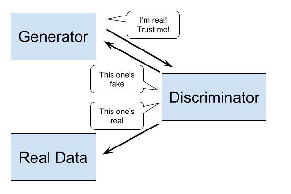

## What is a GAN?

GAN stands for Generative Adversarial Network. The graphic below provides a scientific illustration of what a GAN does.

The GAN consists of two neural networks: a generator and a discriminator. The discriminator's job is to take in some real data and some fake data and decide which one is which. The generator's job is to generate good enough fake data that the discriminator can't tell the difference.

GANs were introduced by Ian Goodfellow in an [eponymous paper](https://arxiv.org/abs/1406.2661). Since then, many researchers have come up with different architectures and tricks to improve training. Gandlf aims to make these advancements more accessible and provide a platform for experimenting with different tweaks. It is built on top of the popular [Keras](https://keras.io/) library, and therefore supports training in both Theano and Tensorflow.

## Why are GANs interesting?

GANs are one of the many exciting things to come out of the field of deep learning in the last several years. They have been used to produce some very realistic-looking data samples (check out the Examples tabs).

To understand why GANs are worth thinking about, here is a thought experiment. Imagine you're watching cars, and trying to predict the color of the next car to drive by. You predict that it will be red, but it turns out to be blue. A conventional neural network loss function would punish your guess, even though it is perfectly reasonable, much more reasonable than guessing, for example, that the next car would be a horse. To be safe, you would have to guess some average of all the possible car colors, so that you're not totally wrong, but never totally right, either. With a GAN, however, would be punish you for guessing a horse, but not for guessing the wrong color car; in other words, as long as you guess a reasonable color, the GAN would be happy.

What is going on here? After some training, hopefully the discriminator learns a representation of "realistic" data. From this representation, the generator learns to "trick" the discriminator. To do this, it just has to produce "realistic" samples; it is only punished if the samples it produces don't seem realistic.

## Resources

Below are some resources for learning more about GANs.

 - [/r/MachineLearning](https://www.reddit.com/r/MachineLearning/)
 - [Adversarial Training Facebook Group](https://www.facebook.com/groups/675606912596390/)

<iframe width="560" height="315" src="https://www.youtube.com/embed/HN9NRhm9waY" frameborder="0" style="padding-bottom: 20px;" allowfullscreen></iframe>

