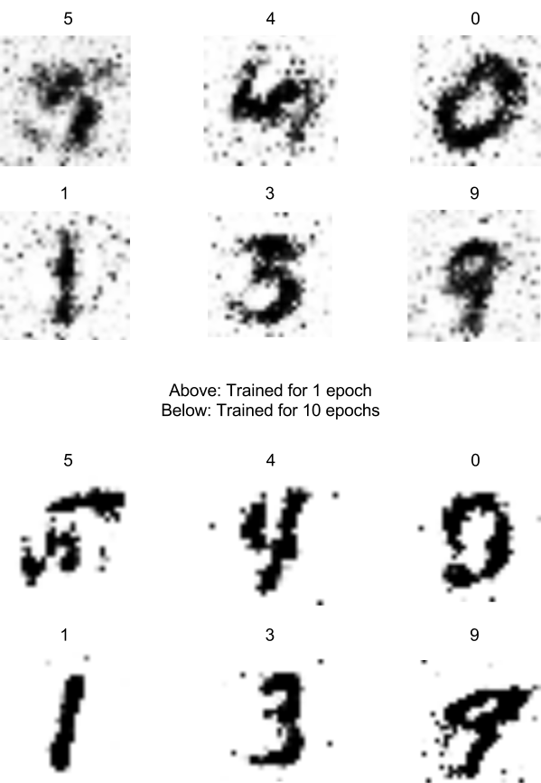
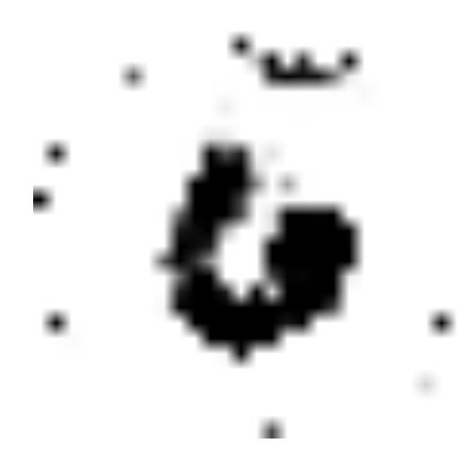

## [MNIST GAN](https://github.com/codekansas/gandlf/blob/master/examples/mnist_gan.py)

This example illustrates how to use a Gandlf model to generate MNIST digits. The model can be run in supervised mode (where the discriminator and generator know the desired class labels) or unsupervised mode (which is a more pure GAN implementation).

This example is a Gandlf implementation of the Keras MNIST ACGAN example, which can be found [here](https://github.com/fchollet/keras/blob/master/examples/mnist_acgan.py). One important distinction is that Gandlf runs the generator and discriminator updates in parallel rather than sequentially; this can't be done in Keras normally.

Samples from this model are still a work in progress (waiting on access to a GPU). If you run it and get interesting results, send them my way! Otherwise, hopefully I'll have these updated in a month or so.

In addition to the convolutional model, a simple feed-forward model can be used for the discriminator and generator which can be trained much more quickly (feasible to run it on a laptop). The samples below show randomly sampled generated images from the lite model, which took about 100 seconds per epoch on a Macbook Pro.

The gif below shows the representation of a 6 when the model is fed latent vectors that interpolate between two points. Because the lite model is not convolutional, the interpolation is not very smooth.

## [Upsampling MNIST Digits](https://github.com/codekansas/gandlf/blob/master/examples/mnist_upsampled.py)

This example is a Gandlf implementation of the blog post [Generating Large Images from Latent Vectors](http://blog.otoro.net/2016/04/01/generating-large-images-from-latent-vectors/). The generator model is trained to take `(x, y)` coordinates and predict the value at that point, to match MNIST digits. The discriminator model takes `(x, y)` coordinates and the value, and decides if the value is realistic or not. Both models also receive information about the class

This approach makes the input space continuous `(x, y)` values rather than discrete points, which means you can sample from intermediate values to scale the image up. For more details, consult the linked blog post.

The images below show samples from the model before training:

The trained samples are a work in progress (waiting on access to a GPU). If you run it and get interesting results, send them my way! Otherwise, hopefully I'll have these updated in a month or so. This model could also be adapted to work with the CIFAR dataset, which can easily be imported in Keras.

## [RNNs on GANs](https://github.com/codekansas/gandlf/blob/master/examples/mnist_rnn_gan.py)

This example illustrates:

 - Using RNNs in your GAN architecture
 - Using attention components to direct GAN learning (with the recurrent attention wrappers, `gandlf.layers.RecurrentAttention1D` and `gandlf.layers.RecurrentAttention2D`)

Samples from this model are a work in progress (waiting on access to a GPU to run it for a longer period). This example is more of a proof-of-concept for how to use RNNs in GANs (in particular, using the attention components to make them supervised).
