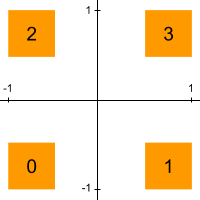

<a href="https://github.com/codekansas/gandlf/blob/master/examples/xor.py" class="icon icon-github"> xor.py</a>

This is a basic example which illustrates the typical "Hello, world!" for neural networks. The input data consists of four uniform distributions, centered near `(-1, -1)`, `(1, -1)`, `(-1, 1)` and `(1, 1)` (illustrated below).

The model can either be trained in unsupervised mode or supervised mode. In the supervised mode, it acts as an auxiliary classifier GAN, which explicitly says which distribution the generated data should come from.

When trained in the unsupervised mode, the data tends to cluster in one of the distributions. A potential way to fix this would be to let the GAN look at a whole batch of data, which would let it know that it's clustering too much on one distribution.
